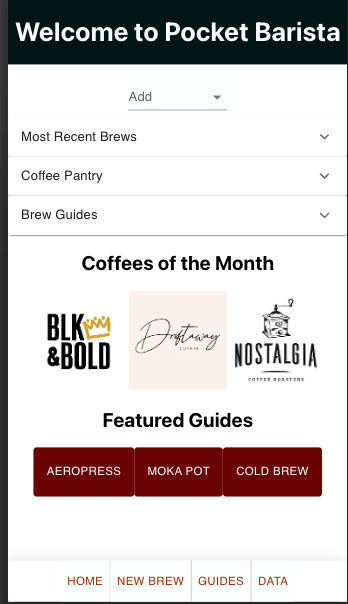

# **_Pocket Barista_**

"Pocket Barista" is a mobile website to allow users to track their home coffee habits. They can track their cups, coffee bags, brewers, and grinders while learning new brewing methods and new roasteries.

---

## **Created By**

---

### Stacy Samuels

Published September 2022

[Email Me](stacy.samuels10@gmail.com) | [GitHub](https://github.com/stacysamuels10/Pocket-Barista/tree/main/pocket-barista) | [LinkedIn](https://www.linkedin.com/in/stacy-samuels/)

---

## **Requirements**

"Pocket Barista" is deployed online, so all you need is this [link](https://63115d9f1f356f1d0a28de6d--pocket-barista.netlify.app/). It is designed to be used on your phone for ease of use while you're brewing your coffee so it is best viewed on a mobile device. This site is a personal project to advance my skills in React/Redux. I was inspired to recreate an app that I use often called Coffee Book. The deployment is meant for ease of viewing on my personal portfolio and not intended to infringe on copyrighted material.

## How Pocket Barista Works

---

### Website Overview

"Pocket Barista" utilizes a front-end library consisting of React and Redux. Users can track every cup they brew, every bag of coffee they buy, and every brewer and grinder they own. They can also learn new methods of brewing through brew guides and each month new roasters are featured on the homepage. Users can also access their data using redux persist(as long as you are on the same browser session) to view every past brew and bag so they can make that 5 star cup over and over again. The "Pocket Barista" is all about creating an app that can be used by people who are passionate about coffee and on that forever quest for the perfect cup of coffee.

---

### Website Features

Here are some of the website's features in greater detail:

- A modern and simple design that utilizes MUI framework.
- Users can record many different aspects about their cup of coffee and rate each cup.
- Users can browse the history of every cup of coffee and coffee bag and equipment piece they own!

---

## Color Palette

The color palette was designed to have a warm feeling to it. A rich red and orange were used to represent the coffee berry that this cherished bean comes from in the high mountains all over the world.

Dark Jungle Green - #001514

White - #fbfffe

Blood Red - #6b0504

Chinese Red - #a3320b

Goldenrod - #e6af2e

---

## Pocket Barista In Development

This website is the conclusion of the final module in my DigitalCrafts bootcamp. "Pocket Barista" is intended to demonstrate a clear understanding of using React.js as a front-end framework. For demo purposes, all information is stored in redux-persist storage; however, the application can easily be converted into pulling and placing information into a database.

Here are some ways I would continue to develop "Pocket Barista":

- Hooking the website to a backend library for a more relevant storage solution.
- Allowing for deleting items off of the users data sets of cups, coffee, and equipment
- Adding timers for the different types of brews
- The ability to edit entries
- Adding dark mode for those early morning and late night coffee drinkers

## Photos of Pocket Barista

